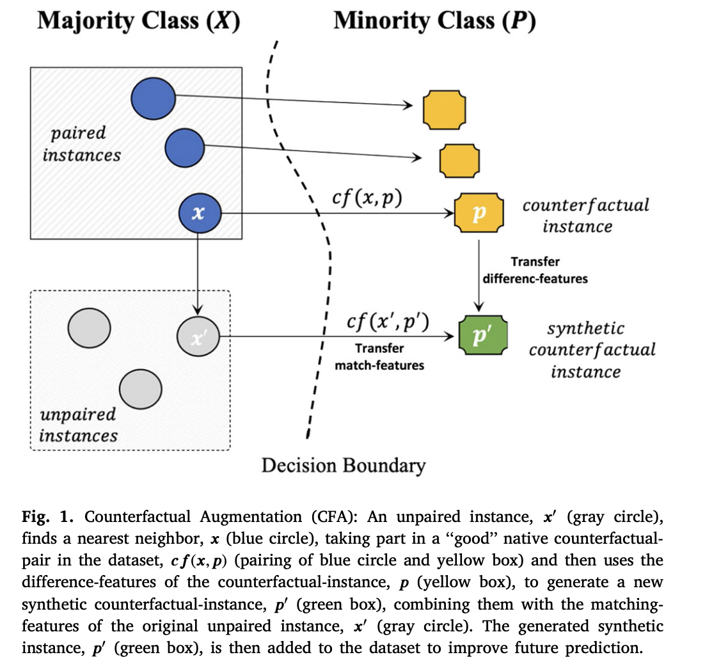

# Counterfactual Data Augmentation (CFA) Library

## Description
This Python library implements the Counterfactual Data Augmentation (CFA) algorithm as described in the paper "Solving the Class Imbalance Problem Using a Counterfactual Method for Data Augmentation" by Mohammed Temraz and Mark T. Keane. The library provides an easy-to-use interface for generating synthetic counterfactual data to address class imbalance issues in machine learning datasets.


[ link to paper ](https://www.sciencedirect.com/science/article/pii/S2666827022000652)
## Features
- **Class Separation**: Automatically distinguishes between majority and minority classes in a dataset.
- **Counterfactual Pairing**: Creates pairs of data points from the majority and minority classes.
- **Synthetic Data Generation**: Generates synthetic counterfactual instances based on the defined tolerance level.

## Requirements
- Python 3.x
- NumPy
- scikit-learn

## Installation
Simply download the `cfa.py` file to your project directory. Ensure that you have the required libraries (NumPy and scikit-learn) installed in your Python environment.

## Usage
To use the CFA algorithm in your project, follow these steps:

1. Import the `CFA` class from `cfa.py`.
2. Create an instance of `CFA` with an optional `tol` and `fd` parameters.
3. Call the `run_cfa` method with your feature dataset `X`, class labels `y`and optional parameter `get_synt_label` to get synthetic label along with the data and the class label.

Example:
```python
import numpy as np
from cfa import CFA

# Example dataset
X = np.array([[0, 0], [1, 0], [0, 1]])
y = np.array([0, 0, 1])  # 0 for majority class, 1 for minority class

cfa = CFA(fd=1, tol=0.1)
# Get synthetic data
X_cfa, y_cfa = cfa.run_cfa(X, y, get_synt_labels=False)
# OR
# Get synthetic data and label (synthetic = {0;1})
X_cfa, y_cfa, cfa_label = cfa.run_cfa(X, y, get_synt_labels=True)


```

## Author
- Original Algorithm: Mohammed Temraz and Mark T. Keane
- Python Implementation: Dorian Joubaud


## Citation
If you use this library in your research, please cite the original paper:
```
[1] Temraz, M., & Keane, M. T. (2022). Solving the class imbalance problem using a counterfactual method for data augmentation. Machine Learning with Applications, 9, 100375. https://doi.org/10.1016/j.mlwa.2022.100375
```

---
